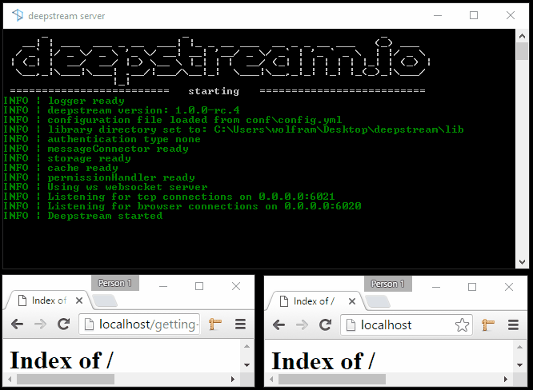

Time to get started with deepstream. This tutorial takes you through the initial steps of starting a server and connecting to it from a simple webpage using the JS Client.



## Start the server

Let's start by installing the server. Just pick the [right version for your operating system](/install/) and follow its steps. Once the server is installed, you can start it with:

```bash
./deepstream start
```

## Getting the client

For this tutorial we'll simply get the client hosted on deepstream.io, but you can also get it as `@deepstream/client` via NPM:


```bash
npm install @deepstream/client
```

Create an _index.html_ file and add the following to it, making sure to point to your client library:

```html
<!DOCTYPE html>
<html>
  <head>
    <script src="https://cdn.deepstream.io/js/client/latest/ds.min.js"></script>
  </head>
  <body>
    <input type="text" />
    <script type="text/javascript">
      //js goes here
    </script>
  </body>
</html>
```

This page consists of one text field ready for user input. Inside the `script` tag, add the following JavaScript to login to your deepstream server:

```javascript
const client = new DeepstreamClient('localhost:6020')
client.login()
```

Next up, we request a "record". Records are small bits of data that are synced
across all connected client.

```javascript
const record = client.record.getRecord('some-name')
```

Finally, let's wire it up to our input field. The goal is to open the same page in multiple browser windows and see the input stay in sync

```javascript
const input = document.querySelector('input')

input.onkeyup = (function() {
  record.set('firstname', input.value)
})

record.subscribe('firstname', function(value) {
  input.value = value
})
```

Open the web page in two browser windows and type text into either of the text fields and the other browser window will reflect changes instantly.

And that's it. There's of course a lot more to deepstream than that. If you'd like to learn more about records and what they can be used for, head over to the [record tutorial](/tutorials/core/datasync/records/). Or start reading about deepstream's [Request/Response](/tutorials/core/request-response/) or [Pub/Sub](/tutorials/core/pubsub/) features.
