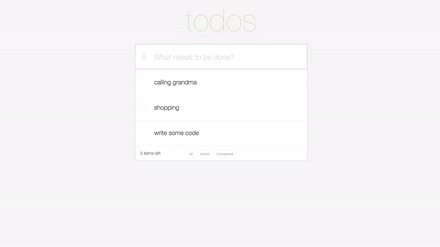

You probably know the [TodoMVC](http://todomvc.com/) project (if not, take a look). We believe that deepstream's lists and records can simplify the development and implementation of many kinds of project, ToDomvc and the like are good examples for that.
This tutorial will show you how to use deepstream's records and lists for building a realtime TodoList app with React.
We definitely recommend being familiar with [Records](/tutorials/core/datasync/records/) and [Lists](/tutorials/core/datasync/lists/) before giving this a go, and, of course, with the React framework.

This is how it looks like:



## Connect to deepstream and log in

Include the JS-client library

`embed: js/include-script.html`

Get your app url from the dashboard and establish a connection to deepstream

`embed: js/create-client.js`

and log in (we didn't configure any authentication, so there are no credentials required)

```javascript
ds.login();
```

## Getting the list and subscribing for updates

Include this in your main component's constructor/getInitialState section:

```javascript
    this.list = ds.record.getList( 'todos' );
    this.list.subscribe(this._setEntries.bind( this ) );
```
Then set the setEntries function that keeps listening to changes in the list (new entry, removed entry):

```javascript
_setEntries( entries ) {
    this.setState({
      todos: entries
    });
  }
```

This.state.todos is an array of record names (entries) retrieved from the list. Now, with this binding, each time a todo item is added or removed, the state of the component is automatically updated.
Each todo item is rendered separately in a different component, being passed a recordName.
Every time the TodoItem component is initiated, it uses the recordName to get the details from the actual record. This is what should be included in the TodoItem's constructor/getInitialState section:

```javascript
this.record = ds.record.getRecord(this.props.recordName);
this.record.subscribe(this.setState.bind(this), true);
```

In that way, first of all, all the data of the record is being retrieved, in this case - the title and the isDone, passed to the state of the component, and rendered. Then, each time there's an update in the record, for example the title is edited, the state of the element is automatically updated (after updating the record), and the component re-rendered.

## Adding/removing/updating ToDo items

Whenever a text is being entered in the input field, two things should happen - a record should be initiated, and the list should get a new entry. This is the function that's being called when a new Todo is in:

```javascript
addTodo() {
    const id = 'todo/' + ds.getUid();
    ds.record.getRecord(id).set({
      title: this.state.newTodo,
      isDone: false
    });
    this.list.addEntry( id );
  }
```
As you can see, first a unique id is being created, then a record is being created with the unique id name, the title from the input field, and a default 'isDone' property that is being set to 'false'. Also, an entry is being added to the list, which automatically sets the state, which makes the whole thing render again with the new record.
When the delete button is being pressed, a function like this should be invoked: 

```javascript
removeTodo() {
  this.props.list.removeEntry( this.record.name );
  this.record.delete();
}
```

To update a record, for example the title, use this:

```javascript
this.record.set('title', title);
```

In case all the checkboxes are checked, and the "Clear Completed" button is being pressed, this how you would empty the whole list:

  ```javascript
      list.setEntries([]);
  ```

For the full code, please take a look at the GitHub  <a href="https://github.com/deepstreamIO/deepstream.io-tutorial-todomvc">repository</a>.

