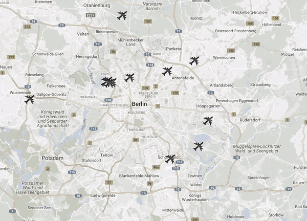

This tutorial will take you through building a realtime flight tracking system with deepstream. We'll be building both a backend provider process that updates the records with the location of flights, and a web based front end that allows us to visualise these. If you'd like to dive straight into the code you can take a look at the GitHub [repository](https://github.com/deepstreamIO/dsh-demo-realtime-flight-tracker).

## Realtime updates via provider

To provide these updates, we'll be polling an endpoint for the location of flights. Since the flights aren't necessarily updated every second, we'll be naively interpolating the data points to create a smoother experience for the end user.

The first thing we'll do is create our backend process that provides the realtime updates to our clients. The only dependencies we'll have for this provider will be the [deepstream Javascript client](https://github.com/deepstreamIO/deepstream.io-client-js) and [needle](https://github.com/tomas/needle), a nice wrapper for making HTTP requests.

We can get a reference to our client as follows, and then get our deepstream `List` of flights, this is the list of flights that clients will be referring to.

```javascript
const client = deepstream('<Your deepstream URL>')
client.login({}, () => {
  flightList = client.record.getList('flights')
})
```
Once we've logged in, we need to start polling our endpoint for flight data, we've put this into a function called `fetchFlightData`.

```javascript
const fetchFlightData = () => {
  needle.get(
  'https://data-live.flightradar24.com/zones/fcgi/feed.js?bounds=52.74,52.19,12.91,13.74',
  (err, resp) => {
    for (const key in resp.body) {
      // some keys contain metadata about the request, we're only concerned about
      // ones that contain an Array of flight data
      if (!(resp.body[key] instanceof Array)) continue
      const [flightId, lat, lng] = resp.body[key]
    }
  })
}
```

From here it gets a bit tricky, since not all flights are updated every second, or even every five seconds, we need to have a buffer where we store interpolated data points. We have a function called `addToBuffer` that does this, and it's a bit dense, so let's break it down.

```javascript
const flights = new Map()

const addToBuffer = (flightId, lat, lng) => {
  const flightName = `flights/${flightId}`
  let flight = flights.get(flightName)
  if (!flight) {
    flight = {}
    flight.record = client.record.getRecord(flightName)
    // check if "flights" contains "flights/1234"
    // if not, add it
    if (flightList.getEntries().indexOf(flightName) === -1) {
      flightList.addEntry(flightName)
    }
    flight.buffer = [{ lat, lng }]
    flight.lastLocation = { lat, lng }
    flights.set(flightName, flight)
  }
```

This part is quite straight forward, because we have a list called `flights`, all our Record names will be prefixed by `flights/`. We have a Map that is going to store various bits of data about the flight, such as the last location and buffer.

```javascript
  if (flight.lastLocation.lat == lat && flight.lastLocation.lng == lng ) {
    return
```

Here we're saying that if the location of the flight retrieved from our HTTP request is the same as it was before, don't do anything.

```javascript
  } else {
    for (let i = 0; i < 50; i++) {
      const newLat = lat - ((flight.lastLocation.lat - lat) / 50) * i
      const newLng = lng - ((flight.lastLocation.lng - lng) / 50) * i
      flight.buffer.push({ lat: newLat, lng: newLng })
    }
    flight.lastLocation = { lat, lng }
  }
}
```

Finally, we have the interpolation step. Here we're creating 50 datapoints between the last known location, and the new one. We then push these into a buffer - we'll get to the buffer in a bit.

Now that we have this buffer, it's a simple matter of setting the Record at an interval with these coordinates. We use the `Array.shift()` function to remove the first entry from the buffer. This way we're always updating the flights location in the correct direction.

```javascript
const updateLocations = () => {
  for (const [flightName, flightData]  of flights) {
    // flight is stationary
    if (!flightData.buffer[0]) continue
    flightData.record.set(
      flightData.buffer.shift()
    )
  }
}
```

Now back at the start of our script we can put the following lines. This starts the fetching of flight data at an interval, and starts updating the Records in our flight list with the location of flights.

```javascript
setInterval(fetchFlightData, 1000)
fetchFlightData()
setInterval(updateLocations, 100))
```

## Web front end

Now that we have our backend process providing these location updates, we need a web interface to display these on. We'll be using the google maps API to display markers, and the deepstream Records to update the coordinates of these.

The first thing we need to do is initialise this map and our deepstream client. We can then get our list of flights and render it. We've left out the code for initialising the map, however if you're interested you can look at it in the GitHub repo.

```javascript
function init() {
  map = new google.maps.Map(document.getElementById('map'), { ... })
  client = deepstream('<Your deepstream URL>')
  client.login({}, (success) => {
    const list = client.record.getList('flights')
    list.whenReady(renderList)
  })
}
```

Inside of our `renderList` function, we're just adding listeners to list events, as well as calling our `addFlightTracking` function on each entry.

```javascript
function renderList(list) {
  list.getEntries().forEach(addFlightTracking)
  list.on('entry-added', addFlightTracking)
  list.on('entry-removed', removeFlightTracking)
}
```

The real work of our front end is inside this `addFlightTracking` function. We create a marker and set the coordinates of it to whatever our Record data is. Our provider process will be sending objects in the form `{ lat: xxx, lng: yyy }`. We then also subscribe to any future changes, updating the markers location in the event of these.

```javascript
function addFlightTracking(flightId) {
  const record = client.record.getRecord(String(flightId))
  const marker = new google.maps.Marker({ ... })

  record.whenReady((record) => {
    marker.setPosition(record.get())
  })

  record.subscribe((data) => {
    marker.setPosition(data)
  })

  markers[flightId] = marker
}
```

After all this, we should have an application that looks as follows:


